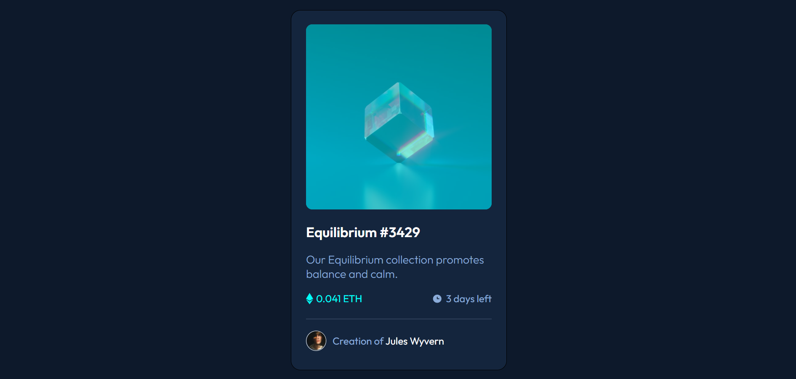
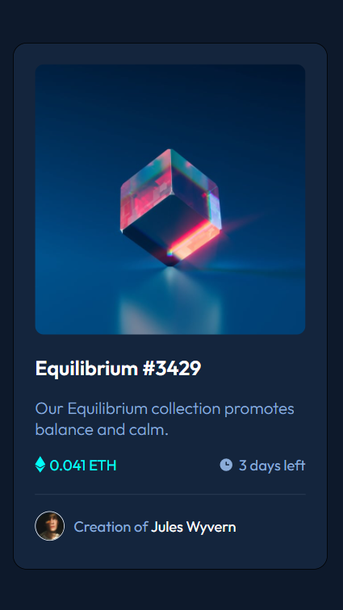

# Frontend Mentor - NFT preview card component solution

This is a solution to the [NFT preview card component challenge on Frontend Mentor](https://www.frontendmentor.io/challenges/nft-preview-card-component-SbdUL_w0U). Frontend Mentor challenges help you improve your coding skills by building realistic projects. 

## Table of contents

- [Overview](#overview)
  - [The challenge](#the-challenge)
  - [Screenshot](#screenshot)
- [My process](#my-process)
  - [Built with](#built-with)
  - [What I learned](#what-i-learned)
  - [Continued development](#continued-development)
  - [Useful resources](#useful-resources)
- [Author](#author)

## Overview

### The challenge

Users should be able to:

- View the optimal layout depending on their device's screen size
- See hover states for interactive elements

### Screenshot





## My process

### Built with

- Semantic HTML5 markup
- CSS custom properties
- Flexbox
- Mobile-first workflow

### What I learned

```css
section:nth-of-type(1) {
  background-color: hsl(178, 100%, 50%);
  height: 294px;
  border-radius: 10px;
}

.equil-img:active {
  cursor: pointer;
  opacity: 50%;
}
```

### Continued development

In the future, I want to be able to complete projects in a shorter period of time. Also, I would like to practice more my Flexbox knowledge and responsiveness.

### Useful resources

- [About hsl()](https://developer.mozilla.org/en-US/docs/Web/CSS/color_value/hsl()) - This MDN article helped me to better understand the hsl colors. 

## Author

- Frontend Mentor - [@denisazaharia98](https://www.frontendmentor.io/profile/denisazaharia98)
