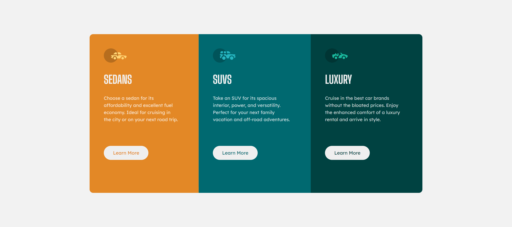
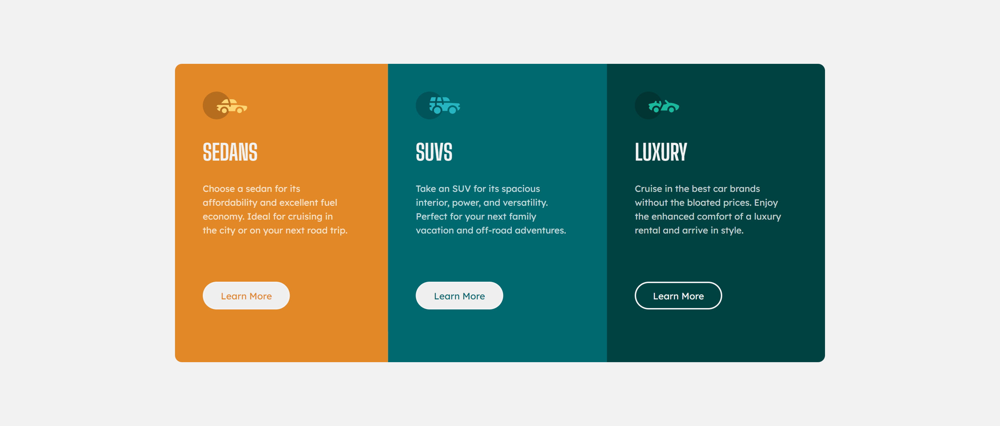
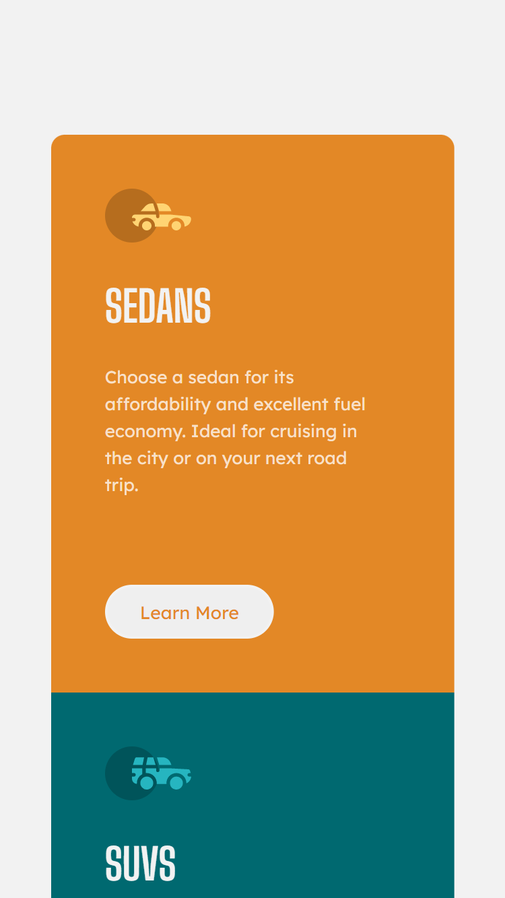

# Frontend Mentor - 3-column preview card component solution

This is a solution to the [3-column preview card component challenge on Frontend Mentor](https://www.frontendmentor.io/challenges/3column-preview-card-component-pH92eAR2-). Frontend Mentor challenges help you improve your coding skills by building realistic projects. 

## Table of contents

- [Overview](#overview)
  - [The challenge](#the-challenge)
  - [Screenshot](#screenshot)
  - [Links](#links)
- [My process](#my-process)
  - [Built with](#built-with)
  - [What I learned](#what-i-learned)
  - [Continued development](#continued-development)
  - [Useful resources](#useful-resources)
- [Author](#author)

## Overview

### The challenge

Users should be able to:

- View the optimal layout depending on their device's screen size
- See hover states for interactive elements

### Screenshot





### Links

- Solution URL: https://github.com/denisazaharia98/Frontend-Mentor-Challenges-Newbie/tree/main/4.%203-column-preview-card-component-main
- Live Site URL: https://denisazaharia98.github.io/Frontend-Mentor-Challenges-Newbie/4.%203-column-preview-card-component-main/

## My process

### Built with

- Semantic HTML5 markup
- CSS custom properties
- Flexbox
- Mobile workflow

### What I learned

```css
@media screen and (max-width: 1020px) and (min-width: 740px) {
  .cards {
    flex-wrap: wrap;
    justify-content: center;
  }
  .cards > * {
    flex: 0 0 33.3333%;
  }
...
}
```

### Continued development

I want to keep doing projects.

### Useful resources

- [Mastering Wrapping of Flex Items](https://developer.mozilla.org/en-US/docs/Web/CSS/CSS_Flexible_Box_Layout/Mastering_Wrapping_of_Flex_Items) - This helped me to display the cards responsive.

## Author

- Frontend Mentor - [@denisazaharia98](https://www.frontendmentor.io/profile/denisazaharia98)
