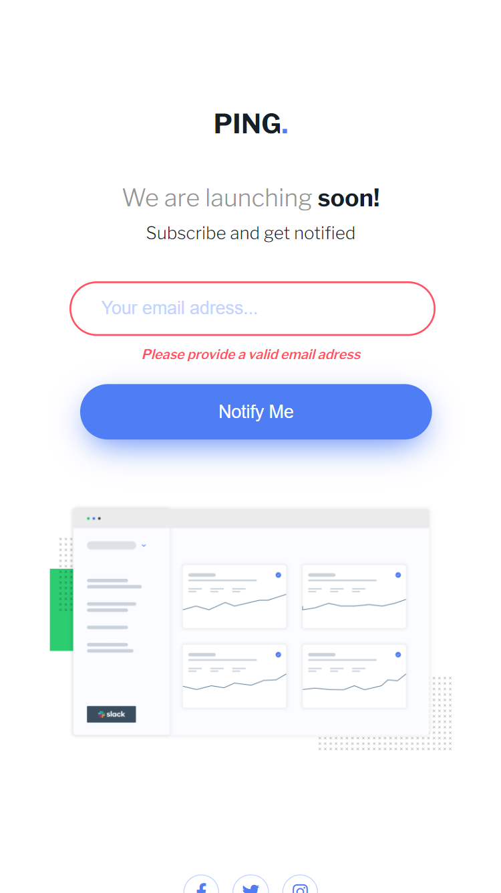

# Frontend Mentor - Ping coming soon page solution

This is a solution to the [Ping coming soon page challenge on Frontend Mentor](https://www.frontendmentor.io/challenges/ping-single-column-coming-soon-page-5cadd051fec04111f7b848da). Frontend Mentor challenges help you improve your coding skills by building realistic projects. 

## Table of contents

- [Overview](#overview)
  - [The challenge](#the-challenge)
  - [Screenshot](#screenshot)
  - [Links](#links)
- [My process](#my-process)
  - [Built with](#built-with)
  - [What I learned](#what-i-learned)
  - [Continued development](#continued-development)
  - [Useful resources](#useful-resources)
- [Author](#author)

## Overview

### The challenge

Users should be able to:

- View the optimal layout for the site depending on their device's screen size
- See hover states for all interactive elements on the page
- Submit their email address using an `input` field
- Receive an error message when the `form` is submitted if:
	- The `input` field is empty. The message for this error should say *"Whoops! It looks like you forgot to add your email"*
	- The email address is not formatted correctly (i.e. a correct email address should have this structure: `name@host.tld`). The message for this error should say *"Please provide a valid email address"*

### Screenshot




### Links

- Solution URL: https://github.com/denisazaharia98/Frontend-Mentor-Challenges-Newbie/tree/main/5.%20ping-coming-soon-page-master
- Live Site URL: https://denisazaharia98.github.io/Frontend-Mentor-Challenges-Newbie/5.%20ping-coming-soon-page-master/

## My process

### Built with

- Semantic HTML5 markup
- CSS custom properties
- Flexbox

### What I learned

```js
const emailRegex =
  /^[a-zA-Z0-9.!#$%&’*+/=?^_`{|}~-]+@[a-zA-Z0-9-]+(?:\.[a-zA-Z0-9-]+)*$/;

button.addEventListener("click", () => {
...
  if (emailRegex.test(email.value) == true) {
    paragraph = "Thanks for being awesome!";
    ...
  } else {
    paragraph = "Please provide a valid email adress";
    ...
  }
  answer.append(paragraph);
});
```

### Continued development

I want to keep doing projects.

### Useful resources

- ["<input type="email">"](https://developer.mozilla.org/en-US/docs/Web/HTML/Element/input/email) - This article helped me to understand it better.
- [PX to REM converter](https://nekocalc.com/px-to-rem-converter) - This tool helped me to convert the pixels to rem.

## Author

- Frontend Mentor - [@denisazaharia98](https://www.frontendmentor.io/profile/denisazaharia98)
